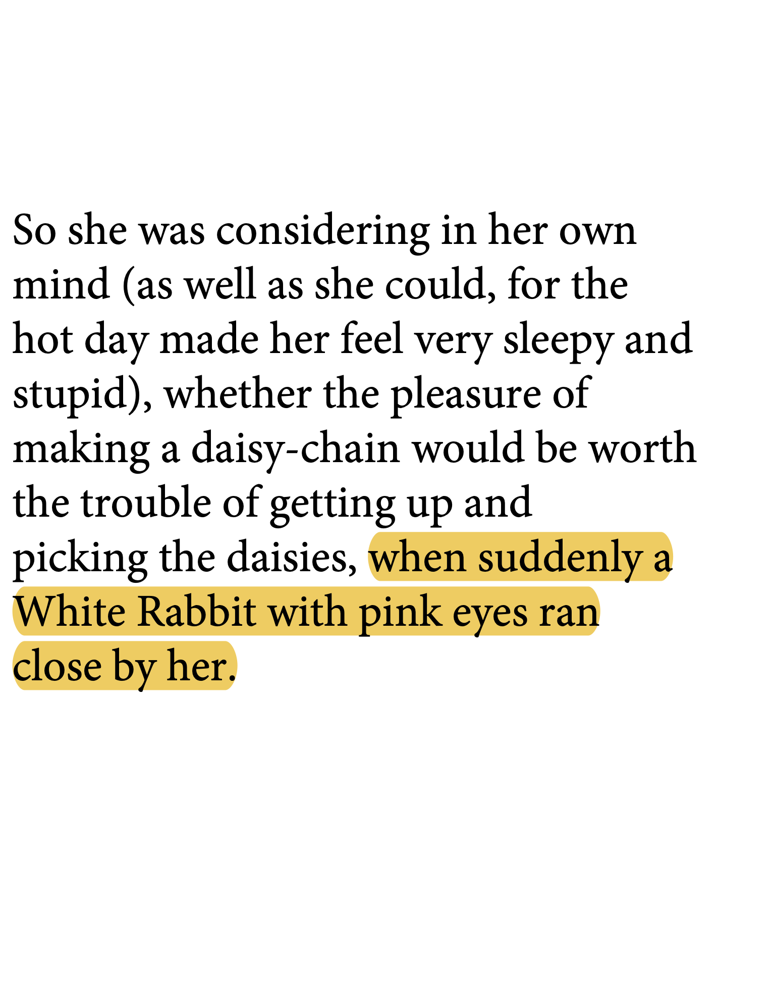

# Extract highlighted text from PDF

<!-- _Full disclosure: I being paid as a consultant by UniDOC/UniPDF to answer this question and spread good will towards PDFs, Go, and UniPDF._ -->

I've written two command-line programs that are equivalent. They both read some number of PDFs that you list, locate highlighted text per page, and then print out CSV of the PDF, page number, and the highlighted text.

For both the PyMuPDF (Python) and the UniPDF (Go) code examples, I'll use these two reference PDFs:

|        | one_page.pdf                                    | two_pages.pdf                                            |
| ------ | ----------------------------------------------- | -------------------------------------------------------- |
| page 1 |  |  |
| page 2 |                                                 |  |

[main.py](./main.py)

```none
./main.py one_page.pdf two_pages.pdf 
Filename,Page_num,Highlighted_text
one_page.pdf,1,word1
one_page.pdf,1,d2 word3 wo
two_pages.pdf,1,"“and what is the use of a book,” thought Alice “without pictures or conversations?”"
two_pages.pdf,2,when suddenly a White Rabbit with pink eyes ran close by her.
```

and

[main.go](./main.go)

```none
go run main.go one_page.pdf two_pages.pdf 
Filename,Page_num,Highlighted_text
one_page.pdf,1,word1
one_page.pdf,1,d2 word3 wor
two_pages.pdf,1,"“and what is the use of a book,” thought Alice “without pictures or conversations?”"
two_pages.pdf,2,when suddenly a White Rabbit with pink eyes ran close by her.
```

The Python program uses the PyMuPDF library, which is being actively maintained and updated. Consult the docs for getting the library installed, [PyMuPDF: Installation](https://pymupdf.readthedocs.io/en/latest/installation.html).

The Go program uses the UniPDF library, which has a freemium tier where 100 document reads/writes are free per month:

- You can run the program here to get a feel for it, [UniPDF Playground: extract highlighted text in PDF](https://play.unidoc.io/p/c7d7e7f44265f889).  

- You can see how to get a free account, create an API key, and start using it here, [How To Set Metered License Key For UniDoc Products](https://www.youtube.com/watch?v=vzazZH55te4).

Both programs also have a VISUALIZE switch in the source code that you can turn on to visualize what the highlight rectangles look like, which can be very handy if you ever start getting weird results. The highlights don't contain the text, they're just graphical objects that are drawn **over** text. Both programs get the highlight rectangles, then use other APIs in their respective libraries to query a page for text _in the rectangle_, but the different libraries have different ideas about what text is inside or outside of a particular highlighted region (rectangle):

- For PyMuPDF I had to grow the highlight rectangle just ever so slightly to get any text.

- For UniPDF I had to shrink the highlight rectangle vertically, and substantially, to avoid extraneous text (outside of the intended highlight region).


If you're new to using Go, you can [download Go](https://go.dev/dl/) for your system (Linux) and then you can run the program interactively with `go run main.go pdf1 ...`, or you can build an executable and install it on your path and then call it like any command-line utility:

```sh
go build -o listhltext main.go
cp listhltext [SOMEWHERE ON YOUR PATH]
```
